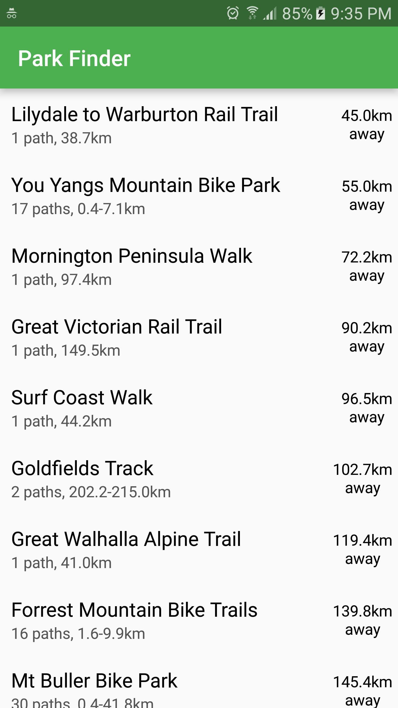
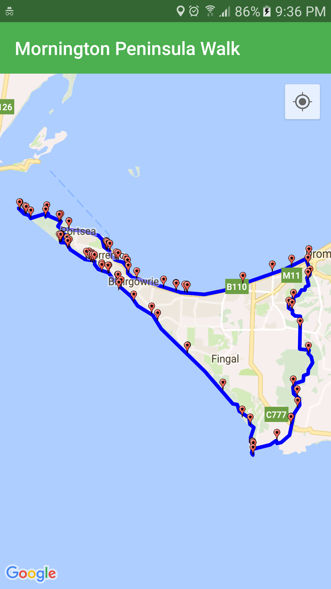

# Park Finder

Park Finder is an Android app to make Victorian parks and walking trails more discoverable to Victorians. It was developed for GovHack 2016.

- Youtube: [https://www.youtube.com/watch?v=j19ApeAwoUI]
- App download link (will be available shortly, pending app store review): [https://play.google.com/store/apps/details?id=com.rockgecko.parkfinder]

# Features
Park Finder lists walking trails throughout Victoria. It uses the PTV transport API to fetch nearest buses to the trails. It uses the Google Machine Vision API to detect landmarks and fauna in photos users upload while on the trail. The data includes certain fauna found on the trail (eg seals, bandicoots, etc).

As a bit of gamification, the app awards points based on:
- Actually visting the park
- Photographing certain fauna
- Photographing recognised landmarks in the park

# Datasets
- Parks Victoria walking trail KML files:
- - EAST GIPPSLAND RAIL TRAIL
- - GREAT SOUTH WEST WALK
- - MT BULLER BIKE PARK
- - FORREST MOUNTAIN BIKE TRAILS
- - GREAT VICTORIAN RAIL TRAIL
- - MURRAY TO MOUNTAINS RAIL TRAIL
- - GIPPSLAND PLAINS RAIL TRAIL
- - GREAT WALHALLA ALPINE TRAIL
- - SURF COAST WALK
- - GOLDFIELDS TRACK
- - LILYDALE TO WARBURTON RAIL TRAI
- - WILSONS PROMONTORY SOUTHERN CIR
- - GREAT OCEAN WALK
- - MORNINGTON PENINSULA WALK
- - YOU YANGS MOUNTAIN BIKE PARK

- PTV transport API: [https://ptv.vic.gov.au/about-ptv/ptv-data-and-reports/digital-products/ptv-timetable-api/]

# Team
- Rockgecko: [http://rockgecko.com]

## Screenshots

